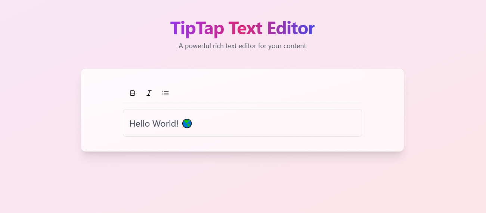

# TipTap Text Editor

A modern, responsive rich text editor built with TipTap, React, and TypeScript. Features a beautiful gradient design and intuitive user interface.




## Features

- 🎨 Modern, responsive design with animated gradients
- ✍️ Rich text editing capabilities
- 💪 Built with TypeScript for type safety
- 🛠 Customizable toolbar with common formatting options
- 📱 Mobile-friendly interface

## Tech Stack

- React
- TypeScript
- TipTap Editor
- Tailwind CSS
- Vite
- Lucide React Icons

## Getting Started

1. Clone the repository:
   ```bash
   git clone git@github.com:SOUMYAGHOSH123-fresher/TipTap-Text-Editor-Website.git
   cd TipTap-Text-Editor-Website
   ```

2. Install dependencies:
   ```bash
   npm install
   ```

3. Start the development server:
   ```bash
   npm run dev
   ```

4. Build for production:
   ```bash
   npm run build
   ```

## Project Structure

```
src/
├── assets/
│   └── screenshot.png
├── editor/
│   ├── components/
│   │   ├── Editor.tsx
│   │   └── MenuBar.tsx
│   └── config/
│       └── editorConfig.ts
├── App.tsx
└── main.tsx
```

## Features

- Bold text formatting
- Italic text formatting
- Bullet lists
- Responsive design
- Beautiful gradient animations

## Contributing

1. Fork the repository
2. Create your feature branch (`git checkout -b feature/AmazingFeature`)
3. Commit your changes (`git commit -m 'Add some AmazingFeature'`)
4. Push to the branch (`git push origin feature/AmazingFeature`)
5. Open a Pull Request

## License

This project is licensed under the MIT License - see the LICENSE file for details.

## Acknowledgments

- [TipTap](https://tiptap.dev/) for the amazing editor framework
- [Tailwind CSS](https://tailwindcss.com/) for the utility-first CSS framework
- [Lucide React](https://lucide.dev/) for the beautiful icons